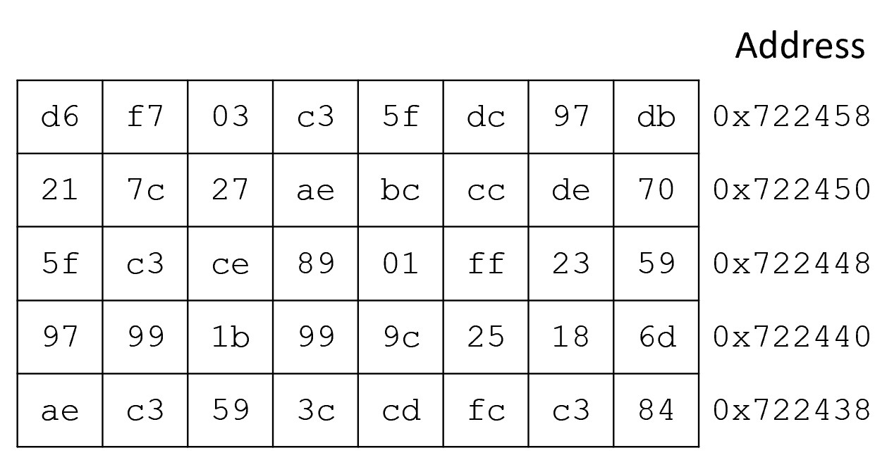

# Lab 13 - Return Oriented Programming

In this lab you will get to practice some of the steps of Return-Oriented Programming, which you will then get to use in the second part of the Attack Project to attack a target executable. 
The first three attacks in the Attack Project do not utilize Return-Oriented Programming, this technique is for the final two attacks. 
This lab is designed to help you successfully complete the Attack Project.  Solutions are at the end of the assignment.  Please give an honest effort before checking your work.  

## Return-Oriented Programming

Return-Oriented Programming (ROP) consists of utilizing pre-existing bytes to compose a sequence of instructions. These bytes are found in the portion of memory which can be executed by the processor, which we will call *instruction* memory. 
ROP is a technique that can still attack a target program even when the program does not allow instructions on the stack to be executed. 

The process of ROP proceeds as follows: 

1. Find instructions to use (we call these gadgets!)
2. Determine the address of each gadget you will use.
3. Determine any data you need for those gadgets (i.e. values on the stack to pop)
4. Set up the addresses and data in your attack input string. 
5. Input your attack string! 

For this lab you will walk thorugh this process in a few simple examples, which will prepare you to complete it on your own for the Attack Project. 

## Example 1
In ROP we cannot write whatever instructions we want.  Instead, we are limited to instructions whose bytes already exist in instruction memory.  For our purposes, instruction memory can be viewed as a big region with seemingly random bytes.  In reality these bytes are parts of encoded instructions, encoded immediate values, encoded strings, encoded addresses, etc., that are part of the program.  Consider the following portion of memory, where addresses increase as we move to the left and up in the memory table. 
The address of the rightmost byte on each line is shown to the right. 

Our goal in this first example is to call the function at address `0x1122334455667788` with the argument `0x2244224422442244` in register `%rdi`. 

We will do this with a single gadget.  In this case a gadget consisting of two instructions: `pop %rdi; ret` will accomplish the task.  The encoding of the `pop %rdi` instruction is `0x5f`, while the encoding of the `ret` instruction is `0xc3`.  

### Question 1 - What is the address of the  `pop %rdi; ret` gadget? 

For this gadget to work, we need to overwrite the original return address on the stack with the address of the gadget, which you just figured out.  
The next thing on the stack needs to be the value we want to put into register `%rdi`. This will be popped off the stack into `%rdi` by the `pop %rdi` instruction that will be executed after the initial return. 
Then, we need to have the address of our target function (`0x1122334455667788`) on the stack so that when the `ret` instruction at the end of the gadget is executed, we will begin executing code in the target function. 

### Question 2 - What is the the hexadecimal representation of our attack input, assuming that there are 8 bytes of filler before the original return address appears on the stack?

## Example 2
For example 2 we will have the same setup as before, but now we want to call the function located at address `0x88776644332211` with the value `0x224224`
in register `%rsi`. 

The `pop %rsi; ret` gadget does not appear in the instruction memory we are working with, so we need to find another sequence of instructions that will accomplish the task.  
One way we can do this is by popping our desired value into another register, and then moving it from that register into `%rsi`.   The encoding of the `pop %rcx` instruction is `0x59`, while the encoding of the `movl %ecx, %esi` instruction is `0x89ce`.   Our attack will then consist of two gadgets:  first, the `pop %rcx; ret` gadget, followed by the `movl %ecx, %esi; ret` gadget.  

### Question 3 - What are the addresses in memory of the two gadgets? 

We can now set up our attack input, laying it out in hexadecimal.  We will have the following, in order: 

1. Our 8 bytes of filler (using the same assumption as before, that the original return address is 8 bytes past the location where our input string starts getting put in memory.) This can be anything we want. 
2. The address of gadget 1. 
3. The value we want to pop into `%rcx`
4. The address of gadget 2. 
5. The address of our target function (`0x8877665544332211`)

### Question 4 - What is the hexadecimal representation of our attack input for this second attack? 

In the attack project, you will take hexadecimal representations (like these) that you will create based on the tasks in the project, and pass them into the `hex2raw` program, saving the output in a file that you will then pass into the programs that you are attacking. 

Check your solutions to the questions.  Once you get the right answer and understand why, you are ready to move onto the Attack Project!  To pass off this lab, simply answer the question in the lab quiz. 

# Solutions - only consult after you have tried to get the answers yourself first!

## Question 1
The `pop %rdi; ret` gadget can be found at address `0x72245b`. 

## Question 2
The first attack input in hex is as follows: 

`ff ff ff ff ff ff ff ff // 8 Filler bytes`  
`5b 24 72 00 00 00 00 00 // Address of gadget (overwrites return address)`  
`44 22 44 22 44 22 44 22 // Value for popping`  
`88 77 66 55 44 33 22 11 // Address of target function`  

## Question 3
The `pop %rcx; ret` gadget can be found at address `0x72243d`. 
The `movl %ecx, %esi; ret` gadget can be found at address `0x72244c`

## Question 4
The second attack input in hex is as follows: 

`ff ff ff ff ff ff ff ff // 8 Filler bytes`  
`3d 24 72 00 00 00 00 00 // Address of gadget 1(overwrites return address)`  
`24 42 22 00 00 00 00 00 // Value for popping`  
`4c 24 72 00 00 00 00 00 // Address of gadget 2`  
`11 22 33 44 55 66 77 88 // Address of target function`  

 Happy Attacking!

