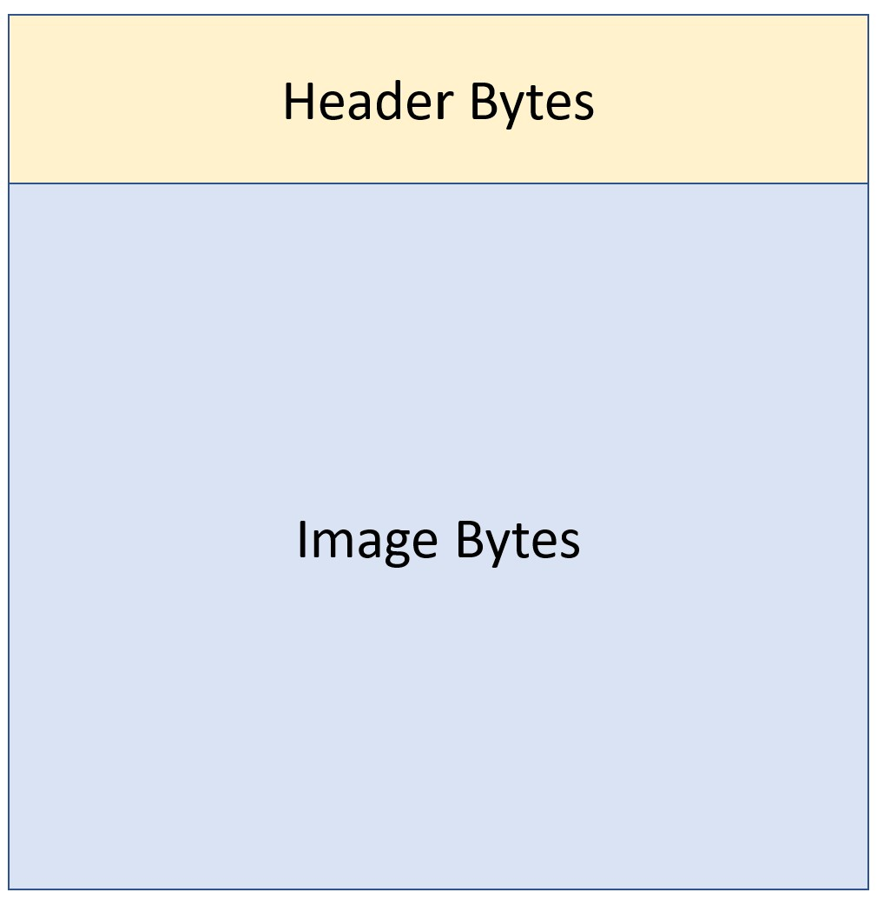
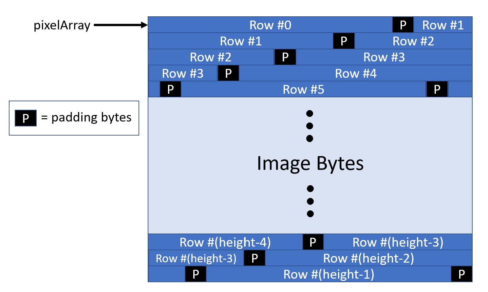
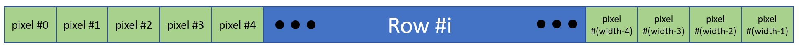
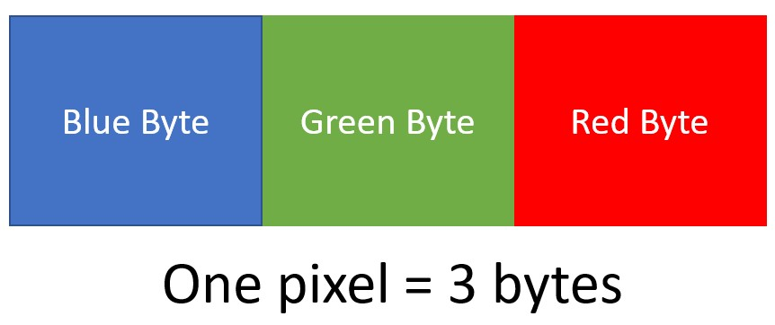

# Lab 5 - Typecasting in C

This lab will give you practice typecasting pointers and working with memory in different ways. 
This lab is intended to prepare you to succesfully complete project 2. 
The code you need for this lab is in `extract.c` and `padding.c`

## Decomposing the Project 2 Task
To begin this lab we want to make sure you understand how project 2 relates to the provided starter code. 
Let's start by looking at the overall structure of a BMP file (All memory images in this lab document will start with the lowest address in the top left, and addresses increasing as we move to the right and down).

***For a more detailed breakdown of the header contents, check the following files: [full bmp format info](bmp-file-info.pdf), [header ordering](headerOrder.png), [BMP header](BMPheader.png), and [DIB header](DIBHeader.png).***

Your tasks in project 2 are to 
  
1. grab relevant values from the header file (width & height of image, offset of the image bytes from the beginning of the file) (*see next task*) 
2. use those to iterate over all the bytes of the image, modifying them according to the specified filter. 

There are many possible ways to write code that will accomplish this task. 
The following principles of code design, taken from the project 2 write-up, are relevant here: 

> Good programing style uses functions to decompose the program into several simple computations, uses self-documenting names for each function and variable, and does not repeat code. These are principles and not absolutes. Use judgement in writing code remembering that making the code simple and readable is more important than making it clever and fast.
>
>Each function should do exactly one thing in general, and it should not take more than 5-25 lines of code to do that one thing. If a function is growing outside that range, then it needs to be decomposed into two or more functions. Learning to break a program into small pieces, each of which is easy to implement, is an important skill that is only learned through discipline and practice. 

As an example, trying to complete the required tasks all with a single `main` function is almost certain to break these rules. 
The provided starter code represents a specific decomposition of the overall task into subtasks, each of which are much smaller and can naturally fit in a small function.  
The goal of this portion of the lab is to ensure that you understand how the provided project 2 starter code is organized, which requires understanding the chosen decomposition.  
This will enable you to utilize the provided function in their intended way to abide by the principles of code design. 

### Decomposing the BMP File

We can first look at how we can decompose the BMP file itself.  
The previous image shows that we can think of the entire BMP file as being filled with a few things.  

1. Header Bytes - these contain important values that you will need to extract (you will get to practice this in the next task)
2. Image Bytes - these bytes contain the actual bytes which specify what the image is. 

#### Image Bytes

What is contained inside the image bytes? Well, lets peek inside!

The image bytes contain two things: 

1. The rows of the image
2. Bits of padding between rows (to ensure that each new row starts at an offset that is a multiple of 4)

#### Rows

How many rows are in the image?  There are exactly `height` of them.  The `height` of the image is something you will pull out of the header.  It will tell you how many rows are in the image. 
How many bits of padding are between each row?  Hold your horses! That will be your final task during this lab!
We can think of the image bytes as an array of rows (+ padding). 

Ok.  So the image bytes contain the rows and padding.  What is a row made of?  Let's look inside a row!

Each row contains all of the *pixels* that make up that row in the image.  You can think of a row as an array of pixels. 
How many pixels are in each row?  Exactly `width` of them.  

#### Pixels
You can probably see where this is going next . . . what makes up a pixel? 

Each pixel consists of exactly three bytes, which specify the Blue, Green, and Red intensity values for that pixel.   
These values can be anything from 0 (0x00) to 255 (0xff).  

### Starter Code Approach
In the starter code, you are provided with several functions, each of which maps nicely onto one of the components of the BMP file that we just covered.  These are: 

  1. `void parseHeaderAndApplyFilter(unsigned char* bmpFileAsBytes, int isGrayscale)`: This function is called from main and is passed a pointer to the beginning of the BMP file (`bmpFileAsBytes`) as well as which filter will be applied. It's job is to grab the header values and then call another function to have it actually process the image bytes (called `pixelArray` in the code).
  2. `void applyFilterToPixelArray(unsigned char* pixelArray, int width, int height, int isGrayscale)`: This function is passed a pointer to the beginning of the image bytes/pixelArray.  Its job is to loop over the rows within the image bytes and pass a pointer to the begining of each row to, you guessed it, another function which will process that row.  To correctly compute the address where the next row starts, the padding (see final lab task) must be taken into account. 
  3. `void applyFilterToRow(unsigned char* row, int width, int isGrayscale)`: This function is called with a pointer to a row in the image.  Its job is to iterate over each pixel in that row and call *another* function to process that pixel.
  4. `void applyFilterToPixel(unsigned char* pixel, int isGrayscale)`: This function is called with a pointer to the first byte of an individual pixel.  Its job is to call the appropriate filter function, given what the user specified (stored in `isGrayscale`). 
  5. `void applyThresholdToPixel(unsigned char* pixel)` or `applyGrayscaleToPixel(unsigned char* pixel)`: Now we finally get to the image processing!  The job of these functions is to actually look at the bytes of the the pixel (Blue/Green/Red) values and overwrite them with their new values, according to how each filter works. 
  6. `unsigned char getAverageIntensity(unsigned char blue, unsigned char green, unsigned char red)`: Each filter needs to know the average intensity of its pixel in order to determine its correct new value. This repeated functionality has been moved into its own function, which computes the average of three input `char`s and returns it. 

Notice that each function does one simple computation that is one part of what is needed to filter the image.

Your assignment for this first part of the lab is simply to determine, for each function in the list above, which other function(s) it needs to call, if any.  Once you have your answer, explain to someone else in lab how your project 2 code will process an entire BMP file.  (You should also let them explain it to you!) Once you both are in agreement as to how this will work, move on to the other parts of the lab. 

## Typecasting and Extracting Values from Memory

Typecasting, as we have covered in class, is the process of changing the type of a pointer, or in other words, creating a new pointer with some specific address of whatever type we desire. 

This new pointer can be used to interpret certain bytes in memory in some specific way.  For example, in project 2, you are given a pointer to the beginning of a huge chunk of memory, the contents of which are the bytes of a BMP file that was input to the program. 
As discussed previously, the first portion of the file contains header information, which is a mixture of many different kinds of information, each stored in the bytes of the file (please see the images and files linked from the project 2 write-up).  
One of your first tasks with project 2 will be to determine, from the provided details about the header file, where certain values are stored in the bytes of the header. 
By *where* we mean the number of bytes from the beginning of the file, or in other words the number of bytes that must be added to the pointer you are given pointing to the first address of the file to get to the bytes storing the specific value you want.  

Once you know where in the header these are stored, the next task is to extract the relevant bytes from memory, interpreted as the correct type.  That is what this part of this lab will focus on. 

Your task is to work with the code in `extract.c`.
This code first initializes 20 bytes of memory using a `char` array. 
We then get an `unsigned char *` pointer `start` which points to the beginning of the array, just like you will have an `unsigned char *` pointer to the beginning of the bytes of your image file in project 2 (the pointer is called `bmpFileAsBytes`). 

Your task is to extract two values from these 20 bytes of memory, as follows. 
1. An `int` from the 4 bytes of memory that start at offset 7 from `start`. 
2. A `short` from the 2 bytes of memory that start at offset 15. 

For each of these you only need to change one line of code, indicated in the starter code below. 
You should only reference `start` in your line of code.
The code then prints out the `int` and `short` values that you extracted as decimal numbers.  

To pass off this portion of the lab, show your TA the two decimal numbers that got printed out.  If they are correct, then you are done.

## Padding in the pixel array

As the project description specifies, in the array of pixels you will encounter during the project, each row of pixels in our 2-D array must have a size (in bytes) that is a multiple of 4. 
Since each pixel takes up 3 bytes of memory, sometimes there is some *padding*, or unused memory, that is skipped over before the bytes of the next row of pixels starts. 

In this part of the lab you will determine how to compute the number of padding bytes correctly. 
This will be useful for you as you move forward on the project. 

You are told the number of pixels in each row (`width` of the image).  
You know that each pixel takes up 3 bytes. 
Your task is to compute how many bytes must be skipped over at the end of each row before the next row of pixels can start at a multiple of 4.

The code provided in `padding.c` will test your computation and let you know if it works correctly. 

To pass off this part of the lab, you simply need to show your TA that you can run the `padding.c` code and get no errors. 

To passoff this lab, show a TA that you have these things working.  Then get going on project 2! Good luck!